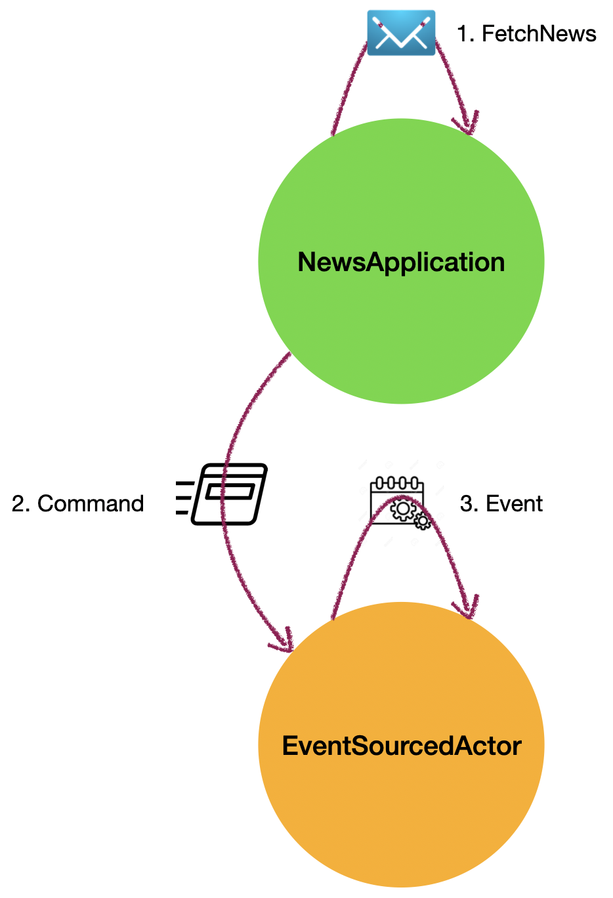

# Akka persistence typed 

## Introduction

A persistent actor is an **event sourced actor**. It receives a (non-persistent) **command** which is first validated. 

If validation succeeds, **events** are generated from the command, representing the _effect of the command_. These events are then persisted and used to change the actor’s state. 

When the event sourced actor needs to be recovered, only the persisted events are replayed as they can be successfully applied to recreate the state of the actor. 

Event sourced actors may also process commands that do not change application state (such as query commands).

------------

## Application 

This application showcases the usage of a typed persistent actor that fetches top, latest or best news from hacker news website using its API. 

As shown in the diagram below, the application consists of two actors; namely, 
 -  `NewsApplication` that responds to `FetchNews` message. This actor is the entry point and guardian actor to the actor system. Upon creation, it also creates its child actor `EventSourcedActor` and sends 5 `FetchNews` messages to itself.
 - `EventSourcedActor` that responds to commands (`FetchTopStories`, `FetchNewStories` and `FetchBestStories`) and generates events (`TopStoriesFetched`, `NewStoriesFetched` and `BestStoriesFetched`) that gather the news from hacker news, provided the state of the persistent actor does not contain the category of news for that day. 
 
 
 ------------